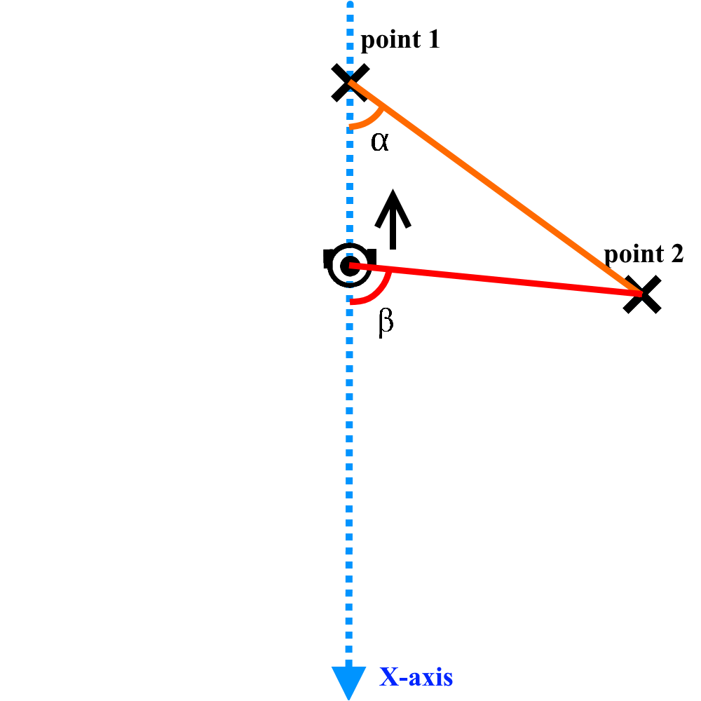
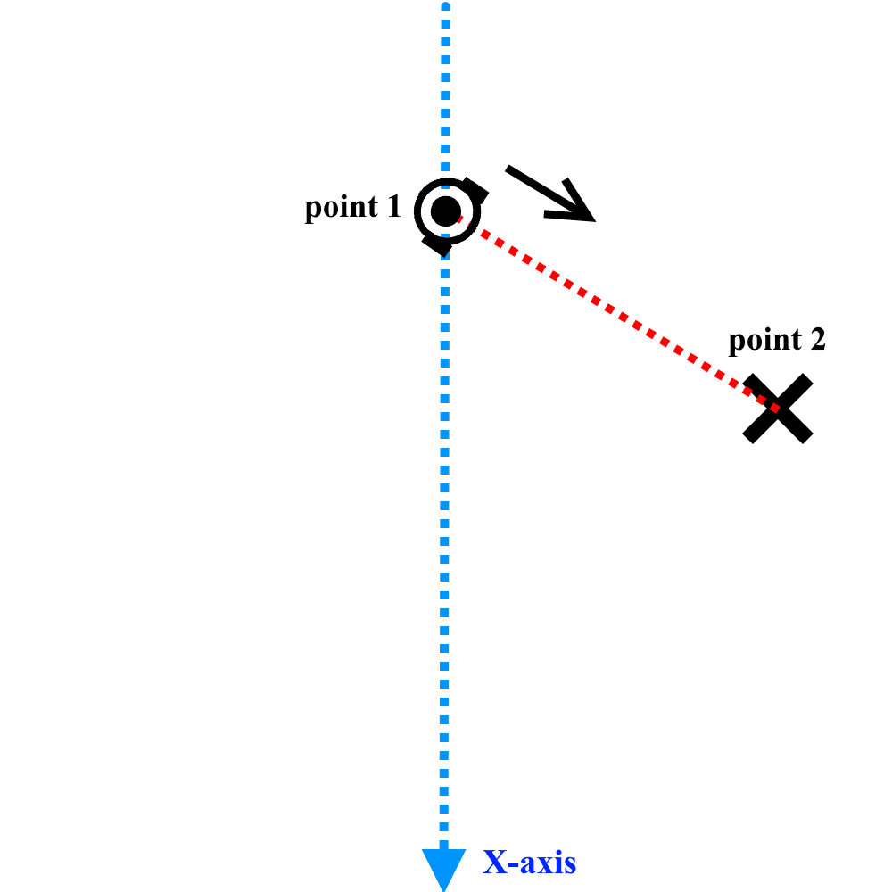
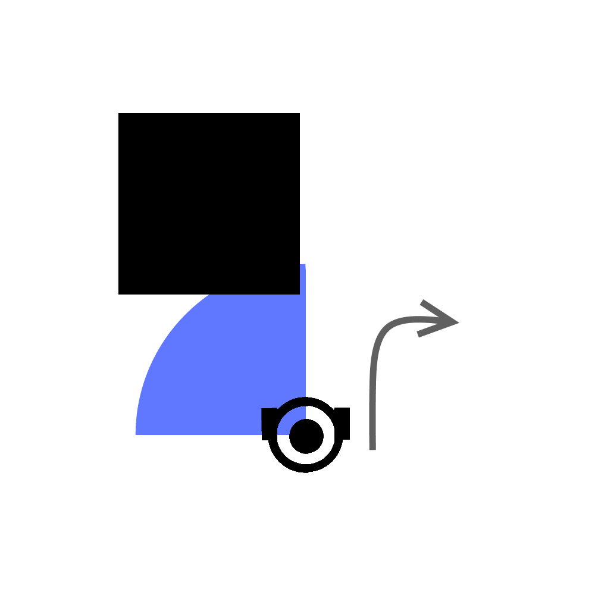
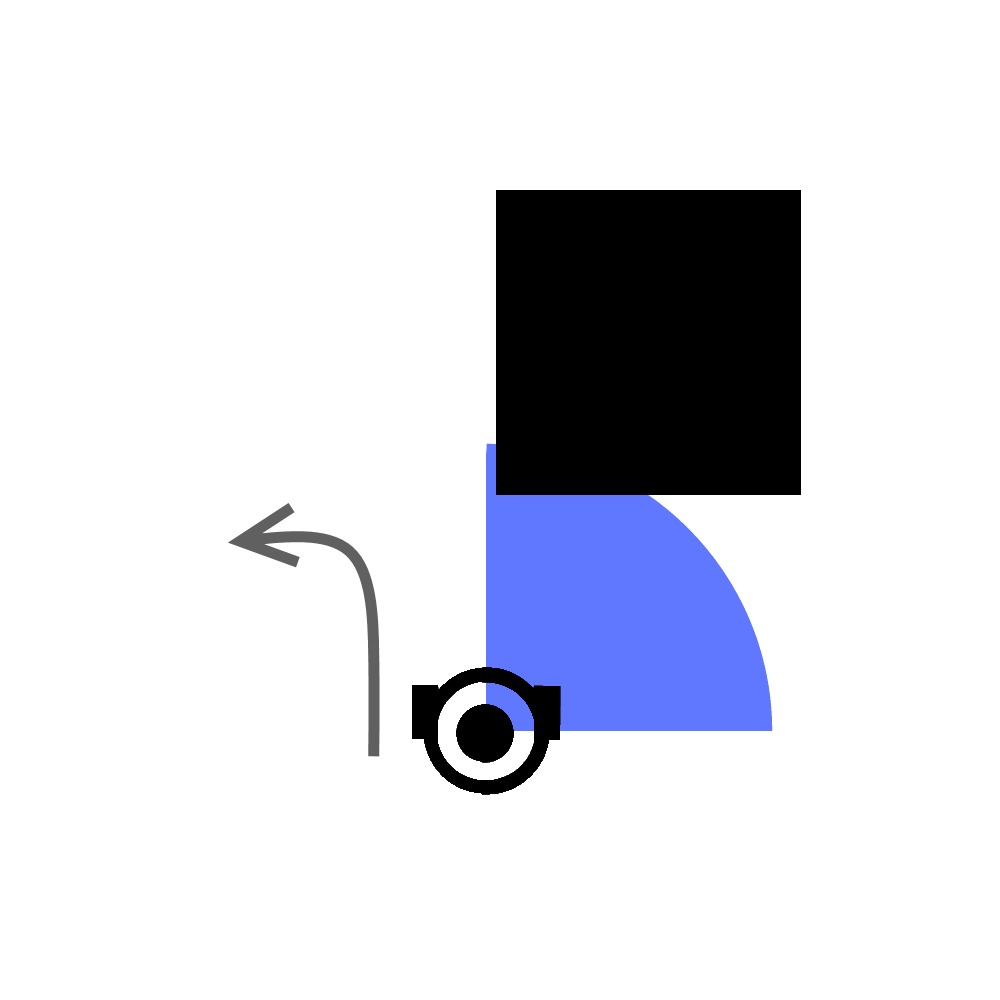

## Algorithm description:
I decided to implement the “shortest distance” algorithm.

The point of this algorithm is to find the shortest distance between two points (just build the line between them) and follow it by all means until reach an obstacle. After reaching an obstacle get away from it and look for this line again.
## Implementation:
Since we have all the coordinates from subscribers, I decided to use a trigonometrical equation to calculate different angles.

First angle is angle between x-axis, point of origin, first goal.
Second angle is the angle between x-axis, Turtlebot, first goal.
Then I compare those angles and if second angle is bigger than first – bot has to turn towards the north and go until the angles are same. This is how the shortest distance line is reached.

Next step is to turn the bot towards the first goal and go in that direction keeping those two angles same.
Repeat 3 times.

If an obstacle is on its way, then turns on an “obstacle avoidance mode”.
By avoiding I mean just turn right if the obstacles are on the front left side quarter of the bot and left if the obstacles are on the front right side quarter.

