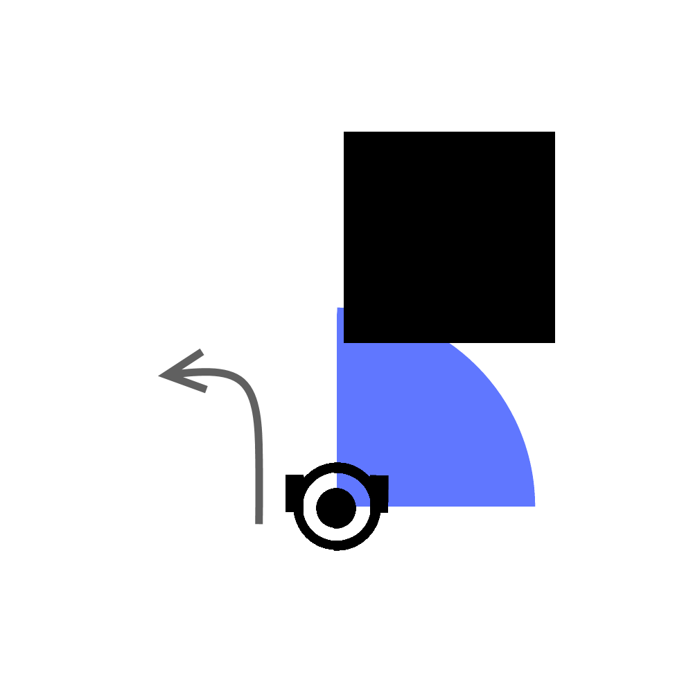

# Final project - Autonomous Mobile Robots
## About
The repository contains all the files necessary to launch the Turtlebot avoiding obstacles scenario.
## Getting started:
I am using Python code and rospy library. For simulating Gazebo is needed.
Code is written and tested on Ubuntu 16.04.
The Repository has to be cloned into the Catkin workspace.
## To launch follow steps:

 - Start roscore in a Terminal by typing:  
 `Roscore`
 - Start gazebo by typing in a new Terminal window:  
`roslaunch turtlebot3_gazebo turtlebot3_empty_world.launch`
 - Place obstacles:  
`rosrun gazebo_ros spawn_model -file ~/catkin_ws/src/kb-171142_tier4/final_project_practice/model.sdf -sdf -x 2 -y 1 -model mini_project`
 - Run the scenario:  
`roslaunch om_171160_prj start.launch`
## General description:
Goal of the project was to make Turtlebot go to the 3 points and avoid the obstacles on its way.
Also there is a time condition. Bot must get to the last point within 5 minutes.

**Topics and services are used/captured:**

 **- /goals**
This subscriber is used to read the coordinates of the goal points on the map.

 **- /gazebo/model_states**
This subscriber is used in order to get position of the bot with respect to the coordinates system. It contains coordinates of the bot as well as quaternion orientation.

 **- /scan**
 This subscriber is used to get the readings from laser sensors of the bot.

 **- /cmd_vel**
This publisher is used to provide speed commands to the bot.

The code consists from a single file 'skynet.py'
It contains the main class which initializes the node ‘skynet’, all the subscribers and velocity publisher.
The class contains all the callbacks and methods as well as the function which provides the logic to bot.
## Algorithm description:
I decided to implement the “shortest distance” algorithm.

The point of this algorithm is to find the shortest distance between two points (just build the line between them) and follow it by all means until reach an obstacle. After reaching an obstacle get away from it and look for this line again.
## Implementation:
Since we have all the coordinates from subscribers, I decided to use a trigonometrical equation to calculate different angles.

First angle is angle between x-axis, point of origin, first goal.
Second angle is the angle between x-axis, Turtlebot, first goal.
Then I compare those angles and if second angle is bigger than first – bot has to turn towards the north and go until the angles are same. This is how the shortest distance line is reached.

Next step is to turn the bot towards the first goal and go in that direction keeping those two angles same.
Repeat 3 times.

If an obstacle is on its way, then turns on an “obstacle avoidance mode”.
By avoiding I mean just turn right if the obstacles are on the front left side quarter of the bot and left if the obstacles are on the front right side quarter.

